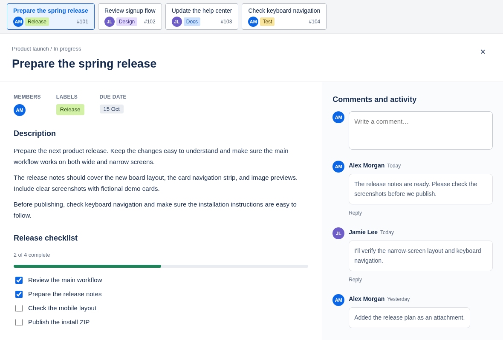
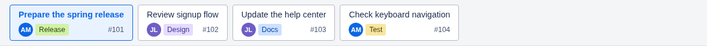
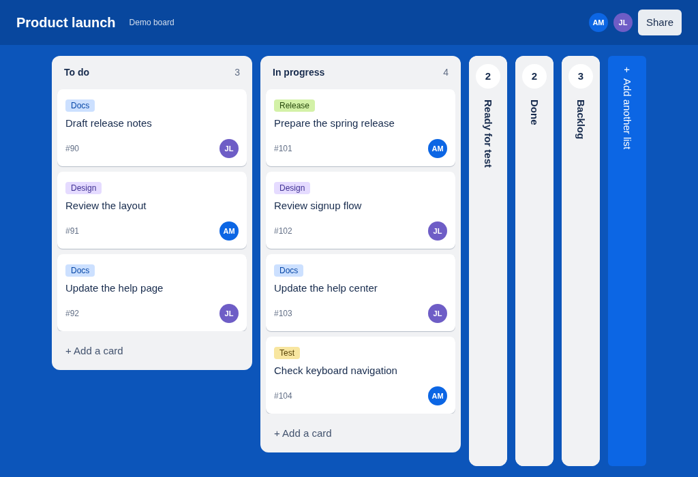
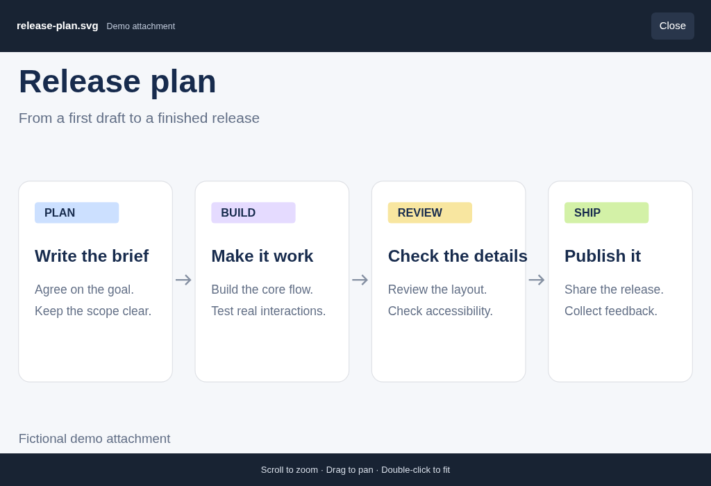

# trello-fix

trello-fix is a Google Chrome extension. It makes Trello cards fill the whole browser tab, so they are easier to read and work with. Up to three board columns can stay open at once.

After installation, Chrome shows it as **Trello Full Page Cards**.

## Install in Google Chrome

Use Google Chrome on a desktop or laptop.

1. [Download trello-fix.zip](https://github.com/michalCapo/trello-fix/releases/latest/download/trello-fix.zip) and unzip it into a permanent folder, such as your Documents folder.
2. Open `chrome://extensions` in Chrome and turn on **Developer mode**.
3. Click **Load unpacked** and choose the **extension** folder inside the unzipped download.
4. Reload Trello.

Keep the unzipped folder. Chrome needs it to run the extension.

## Update

1. [Download the latest ZIP](https://github.com/michalCapo/trello-fix/releases/latest/download/trello-fix.zip), unzip it, and replace the files in your original **extension** folder with the new ones.
2. Open `chrome://extensions`, click **Reload** on **Trello Full Page Cards**, then reload Trello.

## Turn it off

To go back to Trello's normal layout:

1. Open `chrome://extensions`.
2. Turn off the switch on **Trello Full Page Cards**.
3. Reload Trello.

## What it does

Screenshots use fictional demo cards.

### Full-page cards

- Cards fill the whole browser tab.
- On wide screens, comments appear on the right.
- On narrow screens, comments appear below the card.
- Long descriptions show in full. Nothing is cut off or faded.
- Images in descriptions show in full.
- Trello's own buttons, menus, editing, and close button still work. **Escape** still closes the card.

### Card strip

When a card is open, a strip of cards appears above it. The strip shows cards from the same list.

- Click a card in the strip to open it. The current card is highlighted.
- Each card shows member pictures, colored labels, and its card number (for example **#2496**).
- Drag a card in the strip to change its order in the list. Trello saves the new order. Press **Escape** to cancel a drag.
- Keyboard: select a card in the strip and press **Alt+Shift+Left** or **Alt+Shift+Right** to move it.
- Use the mouse wheel over the strip to scroll it sideways.

### Board columns

- At most three lists are open at once.
- The first list is open when the board loads.
- Closed lists appear as narrow tabs with their name and total number of cards.
- Click a closed list to open it.
- Click an open list's header or name to close it. This replaces Trello's click-to-rename.
- If three lists are already open, opening a fourth closes the one opened last.
- Drag a card onto a closed list to move it there. Your open lists stay open.
- **Add another list** is a narrow vertical button. Click it to open the normal list form.
- The board is centered when it fits on the screen. When it is wider than the screen, scroll sideways to see all lists.

### Image previews

- Scroll the mouse wheel to zoom in and out.
- Click and drag to move around the image.
- Double-click, or press **0**, to fit the image to the screen again.
- **+** and **-** also zoom.

## Privacy

- No API key is needed.
- No extra account is needed.
- The extension never asks for your Trello password.
- It runs only on trello.com.
- It does not send your card data to any other service.
- It does not store your card data.

## Troubleshooting

- **Card counts look wrong, or the card strip is missing cards.** Clear any filters on the board. The extension only counts cards that Trello shows on the board.
- **The card strip is missing.** This can happen if you opened a card from a direct link and the board did not load. Open the card from its board instead.
- **Nothing changed after installing.** Reload your Trello tabs.

## For contributors

You only need this section if you want to build or publish a new version. You do not need it to install the extension.

**Requirements:** Make, Git, GitHub CLI (`gh`), and Python 3.

**Commands:**

- `make` lists all available actions.
- `make build` rebuilds `dist/trello-fix.zip` and the identical `trello-fix.zip` in the project root. It does not publish anything. Both ZIPs are generated files and are ignored by Git.
- `make release` or `./release` rebuilds both ZIPs, pushes `main` and the version tag, and publishes `dist/trello-fix.zip` on GitHub Releases.

**To publish a release:**

1. Set the new version in `extension/manifest.json`.
2. Commit all your changes on `main`. The command stops if there are uncommitted changes.
3. Sign in to GitHub CLI with `gh auth login`.
4. Run `make release`.

**Good to know:**

- Only the current GitHub release is kept. After the new ZIP uploads successfully, older releases and their files are deleted.
- Running the release again for the same commit uploads the ZIP again.
- To release a different commit, use a new version number in `extension/manifest.json`.
- If Trello changes its page layout, the extension may stop working. Update the selectors in `extension/content.js`, `extension/column-nav.js`, and `extension/board-columns.js`.
